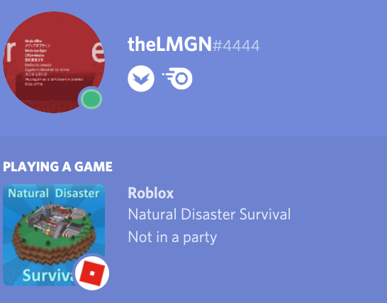

# rblxRP

rblxRP is Roblox Rich Presence.
You can show what game you're playing to the world (of discord).

It uses NodeJS. You'll need that to run it.

I've only tested it on macOS. It'll probably still work on Windows though.

The latest version has icons for

 - Jailbreak
 - Phantom Forces
 - RHS 2
 - Work At A Pizza Place
 - Natural Disaster Survival
 - MM2
 - *Feel free to suggest more in my Discord server*

# Installation
## IMPORTANT Download the *latest* version from https://nodejs.org/en/, the one you want is on the right, where it says current.

1) Install node.js from https://nodejs.org/en/
2) Download this repository and extract it to your computer
3) In the same folder as index.js and package.json, run the command 'npm install' to install any dependencies
4) Once that process is complete, run the file with 'node index.js'
5) Open a Roblox game and enjoy your custom rich presence!

# Questions
If you have any questions, feel free to ask them in my Discord server, or on Twitter.

Both links are available at https://thelmgn.com
